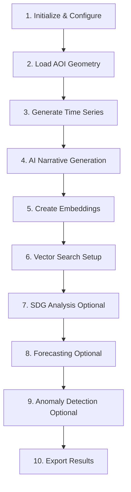

# TerraWatch ASM - BigQuery AI Geospatial Analytics Platform

[](https://www.kaggle.com/)
[](https://cloud.google.com/bigquery)
[](https://earthengine.google.com/)
[](https://www.python.org/)
[](LICENSE)

## 🌍 Overview

TerraWatch ASM is an end-to-end geospatial analytics and AI workflow that leverages Google Cloud's BigQuery ML and Earth Engine to deliver actionable environmental insights. This platform enables automated satellite time series analysis, AI-driven narrative generation, and standards-compliant environmental reporting.

### Key Features

- **🛰️ Satellite Time Series Analysis** - Automated extraction and analysis of multi-temporal satellite indicators (NDVI, BSI, LST)
- **🤖 AI-Powered Insights** - Leverages BigQuery ML and Gemini for intelligent narrative generation
- **📊 Advanced Analytics** - Anomaly detection, forecasting, and trend analysis
- **🌱 SDG Compliance** - UNCCD/MISLAND-aligned degradation analytics for SDG 15.3.1 reporting
- **🔍 Semantic Search** - RAG-based vector search over environmental knowledge corpus
- **📈 ML Forecasting** - Near-term indicator projections using AI.FORECAST/ML.FORECAST

## 📋 Prerequisites

### System Requirements
- **Python:** 3.12.10 (required for reproducibility)
- **Platform:** Kaggle Notebooks or Local Jupyter environment
- **OS:** Windows/macOS/Linux with `gcloud` CLI installed

### Google Cloud Requirements
- Active GCP project with billing enabled
- Required APIs enabled:
  - ✅ Vertex AI API
  - ✅ BigQuery API
  - ✅ Gemini for Google Cloud API
  - ✅ Cloud Dataplex API
  - ✅ Google Earth Engine API
  - ✅ Generative Language API

### Permissions Required
- BigQuery Data Editor
- BigQuery Job User
- BigQuery ML User
- Vertex AI User (for embeddings)
- Earth Engine access (optional)

## 🚀 Quick Start

### Installation
#### Clone the Repository
Using Git (Recommended)
```bash
# Clone via HTTPS
git clone https://github.com/terrawatch/asm-bigquery-ai.git
cd Terrawatch_asm-bigquery-ai

# Or clone via SSH (if you have SSH keys configured)
git clone git@github.com:terrawatch/asm-bigquery-ai.git
cd Terrawatch_asm-bigquery-ai
```
#### Direct Download
- Visit the repository page
- Click the green Code button
- Select Download ZIP
- Extract the ZIP file to your desired location
- Navigate to the extracted folder:

NB: Download the code into one folder and run it, as the notebook depends on the configurations and data in the other files

### 1. Environment Setup

#### Option A: Local Environment
```bash
# Create virtual environment
python -m venv .venv

# Activate (Windows)
.venv\Scripts\Activate.ps1

# Activate (macOS/Linux)
source .venv/bin/activate

# Install dependencies
pip install -U pip wheel
pip install -r requirements.txt
```

### 2. Configure BigQuery ML

Run these commands in Google Cloud Shell or your local CLI:

```bash
# Set project
gcloud config set project YOUR_PROJECT_ID

# Enable required services
gcloud services enable bigqueryconnection.googleapis.com aiplatform.googleapis.com

# Create BigQuery connection for Gemini
bq mk --connection \
  --location=EU \
  --project_id=YOUR_PROJECT_ID \
  --connection_type=CLOUD_RESOURCE \
  gemini_connection

# Verify connection
bq show --connection YOUR_PROJECT_ID.EU.gemini_connection
```

### 3. Set Up Authentication

#### For Kaggle:
Add these secrets in Kaggle settings:
- `GCP_SERVICE_ACCOUNT_JSON` - Full service account JSON content
- `GCP_PROJECT_ID` - Your Google Cloud project ID
- `EE_SERVICE_ACCOUNT` - Earth Engine service account email

#### For Local Development:
```bash
export GOOGLE_APPLICATION_CREDENTIALS="/path/to/service-account.json"
export GCP_PROJECT_ID="your-project-id"
export EE_SERVICE_ACCOUNT="your-ee-sa@project.iam.gserviceaccount.com"
```

### 4. Create Anomaly Detection Model

Execute in BigQuery SQL interface:

```sql
CREATE OR REPLACE MODEL `YOUR_PROJECT_ID.kaggle.anomaly_detection_model`
OPTIONS (
  MODEL_TYPE = 'ARIMA_PLUS',
  TIME_SERIES_TIMESTAMP_COL = 'ts',
  TIME_SERIES_DATA_COL = 'value',
  TIME_SERIES_ID_COL = 'series_id',
  AUTO_ARIMA = TRUE,
  DECOMPOSE_TIME_SERIES = TRUE
) AS
WITH long AS (
  SELECT
    image_date AS ts,
    aoi_name,
    variable,
    value
  FROM `YOUR_PROJECT_ID.kaggle.time_series_analysis`
  UNPIVOT (value FOR variable IN (lst_min, lst_max, ndvi, bsi))
),
series AS (
  SELECT
    ts,
    value,
    CONCAT(aoi_name, '::', variable) AS series_id
  FROM long
  WHERE value IS NOT NULL
)
SELECT * FROM series;
```

## ⚙️ Configuration Parameters

### Essential Parameters

| Parameter | Type | Description | Example |
|-----------|------|-------------|---------|
| `PROJECT_ID` | string | GCP project ID | `"terrawatch-demo"` |
| `BQ_DATASET` | string | BigQuery dataset name | `"eo"` |
| `BQ_REGION` | string | Dataset region | `"europe-west4"` |
| `AOI_GEOJSON_PATH` | string | Path to area of interest GeoJSON | `"/data/voi.geojson"` |
| `TIMESERIES_START_DATE` | string | Analysis start date | `"2018-01-01"` |
| `TIMESERIES_END_DATE` | string | Analysis end date | `"2025-09-01"` |

### Advanced Parameters

<details>
<summary>Click to expand advanced configuration options</summary>

#### Time Series Analysis
- `INDICATORS`: List of indicators to compute (default: `["NDVI", "BSI", "LST_MIN", "LST_MAX"]`)
- `TEMPORAL_STEP_DAYS`: Resampling interval in days (default: `5`)

#### SDG 15.3.1 / UNCCD (Using MISLAND approach done by LocateIT for OSS)
- `BASELINE_YEAR`: UNCCD baseline year (default: `2015`)
- `TARGET_YEAR`: Comparison year (default: `2023`)
- `ANALYSIS_MONTH`: Focus month for seasonal analysis (optional)

#### Forecasting
- `FORECAST_INDICATOR`: Column to forecast (e.g., `"NDVI_mean"`)
- `FORECAST_STEPS`: Number of periods to forecast (default: `6`)

#### Anomaly Detection
- `ANOMALY_INDICATOR`: Column to analyze for anomalies
- `ANOMALY_METHOD`: Detection method (`"zscore"` or `"iqr"`)
- `ANOMALY_Z_THRESHOLD`: Z-score threshold (default: `2.5`)

#### AI/ML Models
- `GEN_TEXT_MODEL`: Text generation model (default: `"gemini-2.0-flash-lite-001"`)
- `EMBEDDING_MODEL`: Embedding model (default: `"text-embedding-004"`)

</details>

## 📊 Workflow Execution

The notebook executes the following pipeline:



### Execution Steps

1. **Initialization** - Set up BigQuery client and validate configuration
2. **AOI Loading** - Import area of interest from GeoJSON
3. **Time Series** - Extract satellite indicators for AOI
4. **AI Analysis** - Generate insights using BigQuery ML
5. **Embeddings** - Create searchable knowledge base
6. **Vector Search** - Enable semantic queries
7. **SDG Reporting** - Optional MISLAND analysis
8. **Forecasting** - Project future trends
9. **Anomaly Detection** - Identify unusual patterns
10. **Export** - Save results to BigQuery/GCS

## 📁 Project Structure

```
terrawatch-asm/
├── kaggle_demo_BigQueryAI_FINAL.ipynb  # Main notebook
├── requirements.txt                     # Python dependencies
├── config/
│   └── config.yaml                     # Configuration file
├   |___boundaries/
│          └── voi.geojson                 # AOI boundaries (optional)
└── README.md                           # This file
```

## 🔧 Troubleshooting

### Common Issues and Solutions

| Issue | Solution |
|-------|----------|
| **BigQuery Authentication Error** | Verify service account permissions and `GOOGLE_APPLICATION_CREDENTIALS` |
| **Region Mismatch Error** | Ensure all BigQuery resources are in the same region |
| **Earth Engine Init Failure** | Run `ee.Authenticate()` then `ee.Initialize()` |
| **Vector Search Unavailable** | Use SQL cosine similarity as fallback |
| **Missing MISLAND Outputs** | Re-run MISLAND computation for your AOI |
| **Forecast Generation Failed** | Verify sufficient historical data (>30 days) |
| **Anomaly Model Error** | Ensure the ARIMA_PLUS model is created in BigQuery |

### Debug Commands

```bash
# Check BigQuery dataset
bq ls -d --project_id=YOUR_PROJECT_ID

# Verify service account permissions
gcloud projects get-iam-policy YOUR_PROJECT_ID \
  --flatten="bindings[].members" \
  --filter="bindings.members:serviceAccount:YOUR_SA_EMAIL"

# Test Earth Engine connection
python -c "import ee; ee.Initialize(); print('EE OK')"
```

## 📤 Output Artifacts

The workflow generates the following outputs:

### BigQuery Tables
- `{dataset}.time_series_analysis` - Satellite indicator time series
- `{dataset}.narrative_summary` - AI-generated insights
- `{dataset}.documents_embeddings` - Searchable knowledge base
- `{dataset}.forecast_{indicator}` - Predictive analytics
- `{dataset}.anomalies_{indicator}` - Anomaly detection results
- `{dataset}.misland_*` - SDG 15.3.1 compliance metrics

### Optional Exports
- CSV files to Google Cloud Storage
- Visualization charts (PNG/SVG)
- JSON reports for dashboard integration

## 🤝 Contributing

We welcome contributions! Please follow these guidelines:

1. Fork the repository
2. Create a feature branch (`git checkout -b feature/AmazingFeature`)
3. Commit changes (`git commit -m 'Add AmazingFeature'`)
4. Push to branch (`git push origin feature/AmazingFeature`)
5. Open a Pull Request

## 📚 Documentation

- [BigQuery ML Documentation](https://cloud.google.com/bigquery-ml/docs)
- [Earth Engine Guide](https://developers.google.com/earth-engine)
- [Vertex AI Embeddings](https://cloud.google.com/vertex-ai/docs/generative-ai/embeddings/get-text-embeddings)
- [SDG 15.3.1 Methodology](https://misland.readthedocs.io/en/latest/Background/LD_indicators.html)

## ⚖️ License

This project is licensed under the MIT License - see the [LICENSE](LICENSE) file for details.

## 🙏 Acknowledgments

- Google Cloud Platform for BigQuery and Earth Engine infrastructure
- Kaggle for the inovation competition that challenged as to think on a broader perspective to adress climate related issues using the emerging technologies
- UNCCD for SDG 15.3.1 methodology guidelines
- Contributors and maintainers of the TerraWatch ASM project

## 📞 Support

For issues, questions, or suggestions:
- 📧 Email: bonfaceoscar05@gmail.com
- 🐛 Issues: [GitHub Issues](https://github.com/Bonface9067/Terrawatch_ASM/issues)
- 💬 Discussions: [GitHub Discussions](https://github.com/Bonface9067/Terrawatch_ASM/issues)

---

<div align="center">
  <strong>Built with ❤️ for Environmental Monitoring</strong>
  <br>
  <sub>© 2025 TerraWatch ASM Team</sub>
</div>